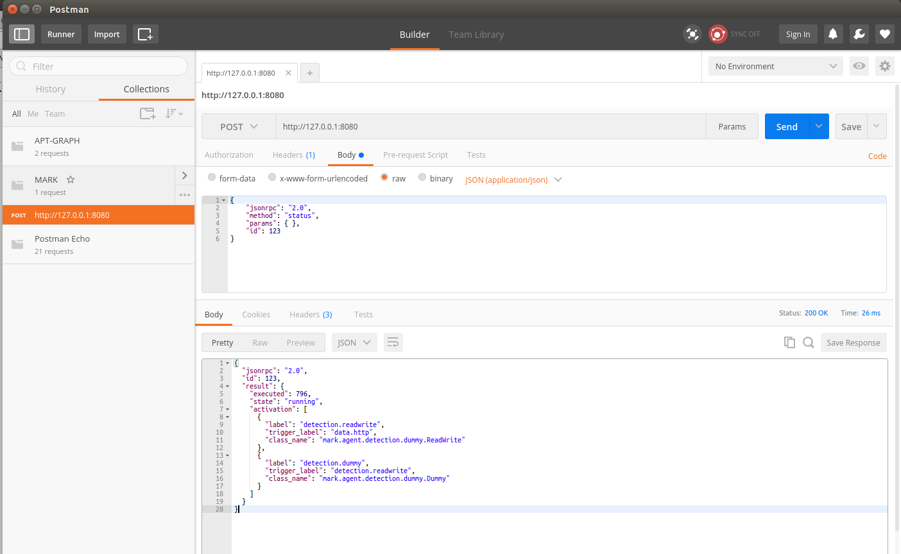

# MARK
[](https://travis-ci.org/RUCD/mark)

The **Multi Agent Ranking Framework** allows to easily implement large scale detection and ranking systems.


## Architecture

A MARK **server** consists of:
  - A **datastore** : a **json-rpc server** (based on a Jetty http server) that will receive requests to add or retrieve data. The rpc-server connects to a **MongoDB** server to actually store the data.
  - An **activation logic engine** that decides which agents should be triggered when new data or new evidences are saved to the database. The activation logic engine starts and connects to an Apache Ignite compute cluster to run the analysis tasks.
  - A **web server** (also based on Jetty) to serve the web interface. This web interface is implemented using PHP and JavaScript.
  - Optionaly: **data agents** to push data to the datastore. Data agents can be
    - **file based**: they read a file containing the data and push the content to the datastore
    - **network based**: they open a tcp server that receives data (e.g. syslog) which is pushed to the datastore

The server is independant of the data that will be analyzed (the subject). Hence the actual implementation must provide a SubjectAdapter...


## Maven modules
- **core:** contains core interface definitions (Evidence, RawData, ServerInterface)
- **client**: contains a java client class to connect to the server and perform requests
- **server:** contains the server code, with basic agents
- **integration:** contains integration tests (which require compiled core, client and server code)
- **netrank:** contains a LinkAdapter (that implements the SubjectAdapter interface) to run the system with network related data, to rank the links bewteen computers according to suspiciousness
- **mark:** maven parent module, that allows to compile and test all modules at once

## Building & running

To run the system, you need a MongoDB server running.

To build the complete system:
```
cd mark
mvn clean install
```

The server/scripts folder contains a startup script with a basic configuration (no agents).

The netrank/scripts also contains a startup script, which contains some real things to display: a source of data, an adapter and 2 detection agents in cascade.

```
cd netrank
./scripts/run.sh
```

When the server is started, it will launch your browser and display the status page.

## Datastore calls

The list of json-rpc calls available in the datastore is defined by the interface

https://github.com/RUCD/mark/blob/master/core/src/main/java/mark/core/ServerInterface.java

### status

